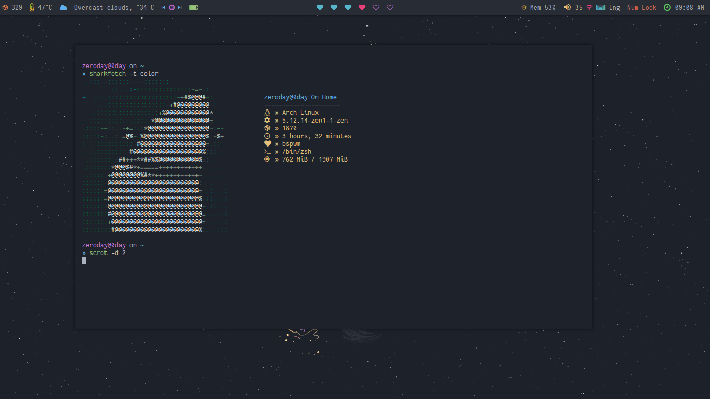
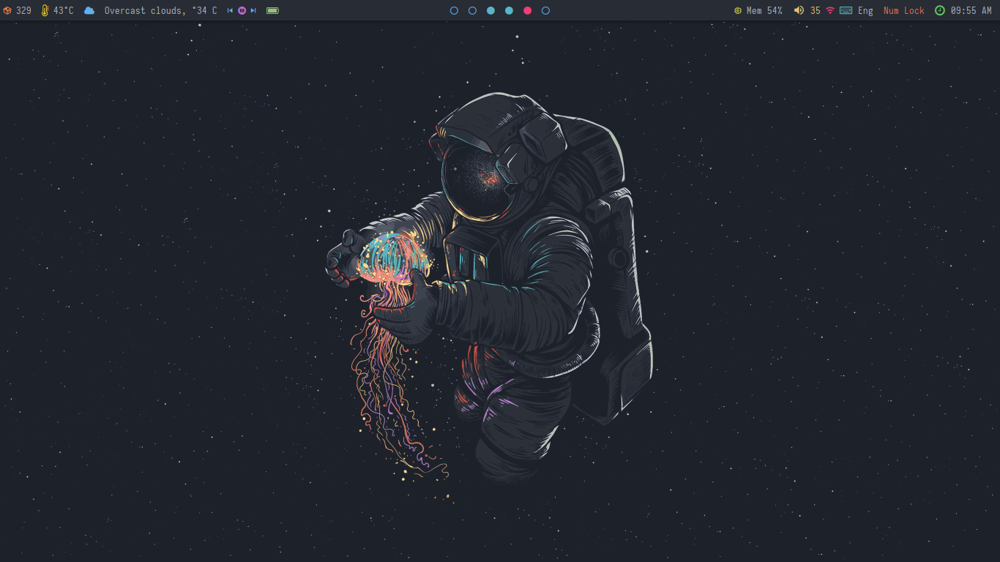

## My BSPWM Rice

Follow the [WIKI](https://wiki.archlinux.org/title/bspwm) to install BSPWM And [Polybar](https://wiki.archlinux.org/title/Polybar)

* If U use this repo, Do not forget to **CHANGE** the path of the files

## Polybar Modules
**On-Screen : [SharkFetch](https://github.com/The-0Day/SharkFetch)**

## Rofi - Launcher CENTER

## Rofi - launcher L

## Rofi - launcher Down

## Rofi - MPD 

# Polybar Module - Bspwm-Round

